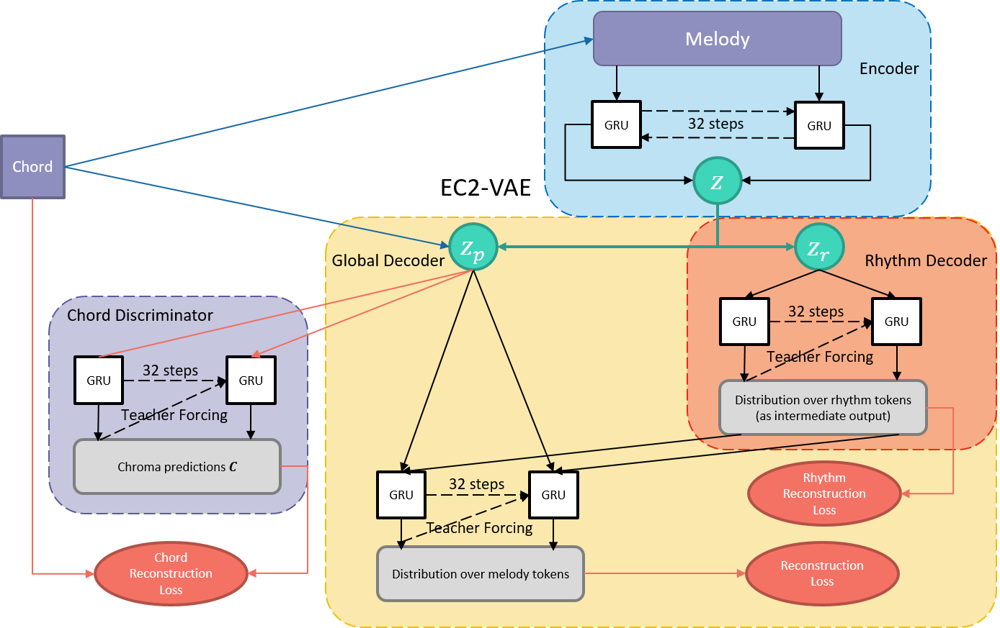
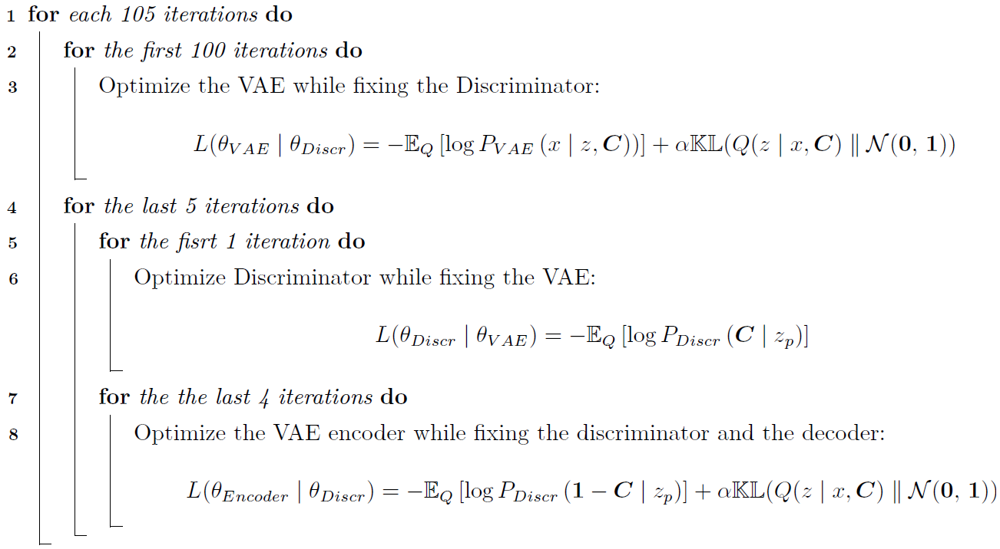

# Adversarial EC2-VAE: Melody Generation towards Better Chord Control

## 1. Introduction to the Work

This work improves the melody generation model, EC2-VAE, with better chord controllability. The original model’s latent pitch embedding is not a chord-invariant representation, and thus cannot induce the network to learn a chord-melody dependency. To detach the chord cues, we introduce an adversarial loss which is minimized by a chord discriminator and maximized by the VAE. The adversarial training imposes the network with minimum chord information and encourages the decoder to explicitly rely on extra chord conditions. Demos illustrate a much more reliable chord control than the model’s original performance in ISMIR 2019.

Concretely, the framework of adversaril EC2-VAE is shown as below:

  

The VAE model is trained to optimize the adversarial loss as follow:

  

## 2. Code and File Arrangement

In this work, the codes and files are arranged as follow:

1) **train.py** is script for a simple adversarila training with two losses mentioned above: VAE loss and Chord Discriminator loss;
2) **train_triAd.py** is an upgraded version which specifies three losses: VAE loss, Discriminator training loss, Discriminator infering loss;
3) **vae.py** and **vae_triAd.py** are the model frameworks for each setting of training;
4) **/demo chord control** stores demos of melofy generatino controled by chord variations.

## 3. Dependencies

1) **Numpy**;
2) **pytorch 1.5** or higher;
3) **PrettyMIDI**.

## 4. References

1) Yang, Ruihan, et al. "Deep music analogy via latent representation disentanglement." arXiv preprint arXiv:1906.03626 (2019). <https://github.com/buggyyang/Deep-Music-Analogy-Demos>

2) Kawai, Lisa, Philippe Esling, and Tatsuya Harada. "ATTRIBUTES-AWARE DEEP MUSIC TRANSFORMATION." <https://lisakawai.github.io/music_transformation/>

Zhao Jingwei: jz4807@nyu.edu

2020.12.27